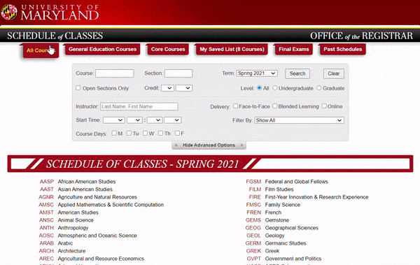

# UMD Professor Ratings
> Compare professor ratings right next to their class offerings

## Table of Contents
* [General Info](#general-info)
* [Images](#images)
* [Skills](#skills)
* [Status](#status)
* [Contribution](#contribution)
* [Meta](#meta)
* [Reflection](#reflection)

## General Info

Have you ever checked RateMyProfessor or PlanetTerp while picking
your classes? I would bet money that you have. I know there is nothing
I hate more than taking a class with a bad professor. 

Now, with this [Chrome Extension](https://chrome.google.com/webstore/detail/umd-professor-ratings/fgfodddkancncjeipifhldbceifkomhi?hl=en&authuser=0), you don't even have to leave the page to get 
professor ratings. You can easily choose the right classes for you and 
be confident that you will enjoy the professor.

## Images

## Skills

- Google Chrome Extensions
- Javascript
    - Ajax
    - JQuery
    - MutationObserver
- API Calls (PlanetTerp)

## Status

*Completed*

## Contribution

1. Fork it (<https://github.com/matthewfoulk/cuttle/fork>)
2. Create your feature branch (`git checkout -b feature/fooBar`)
3. Commit your changes (`git commit -am 'Add some fooBar'`)
4. Push to the branch (`git push origin feature/fooBar`)
5. Create a new Pull Request

## Meta

Matthew Foulk – [LinkedIn](https://www.linkedin.com/in/matthew-foulk-a7a24318a/) – matthewrfoulk@gmail.com
updates by Forrest Milner – [LinkedIn](https://www.linkedin.com/in/forrest-milner-4b76191aa/) – forrestmilner@gmail.com

Distributed under the MIT license. See ``LICENSE`` for more information.

## Reflection

Start Date: 12/10/2020  
End Date: 12/11/2020  

I pick 100% of my classes based on the quality of professors because 
they make or break a class. I had just finsihed registering for the 
spring semester and realized how often I would choose a class, then 
look at the professor's ratings on another site, only to find out that
they well... uh... sucked. So I knew, if onlyfor my sake, I need to the 
simplify this process.

Similar to my Cuttle project this morphed from discussions my sister
[Kelly Foulk](https://github.com/klfoulk16) and I had trying to come up 
with a partner project. The original idea revolved around a Flask 
application and web-scraping, but onceI thought about it I realized 
that it made much more sense to keep the ratings on the same page as 
students typically visit. That could mean only one thing: Javascipt,
one of my many old enemies, second only to CSS.

I have never really used Javascript minus one or two things I did 
for the Harvard CS50 introductory course, but I remeber the syntax
being confusing. So going into the project I was a little worried that
I was going to struggle. Thank god I've been taking Java classes
because, although different, I felt I had a much better appreciation
for the syntax and was able to grasp the basic concepts rather 
quickly.

I brushed up on some other old buzzwords I could barely remember like
JQuery and Ajax, still not completely onboard with how those two work
but I found them massively helpful. The most difficult challenge of 
the entire project was understanding how something (aka Ajax) could
run asynchronously and screw the whole order of my program. It baffled
my mind that a single thread could find a way to basically run two
things at once. 

I'd like to give a big shoutout to Google for making the Chrome
Extension process super simple. I basically slapped a manifest.json
file ontop of it all and *wallah* it worked. Also the testing and 
publishing process could not have been simpler.

I don't have any desire to expand beyond the simple benefits this
application provides, but if I were to give it some thought there 
are a few improvements I would make. First, I would make it easier
to distingiush between good professors and bad professors possibly
with some sort of color scale. Second, I would provide some way to
filter class/teacher offerings based on their rankings. Third, I 
would improve basic functionality like providing user feedback even
when no rating is found such as "N/A" and better handling of courses
being taught by two professors. Finally, if I'm shooting for the moon
it would be awesome to provide some required classes and minimum teacher
ratings then formulate a schedule for a student.

All-in-all, this was a fun project that produced something really useful
and taught me several skills I had little to no experience, all the while
taking almost no time.
